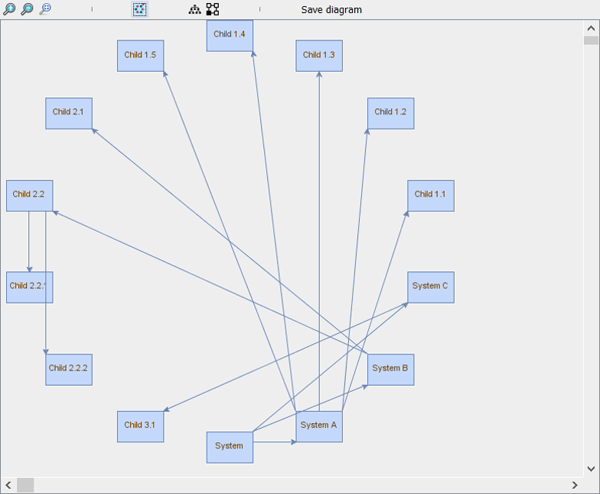

# MBSE Graph Data Visualizer

The prupose of this project is to allow a quick automatic positionning for MBSE models.

The project is currently under developement.

## Demo
For a provided graph, different layouts are possible as illustrated below:

User selects the best layout that fits his needs and can "Save diagram".
Positions for provided objects will be available in the MBSE tool.

## Installation
Will be provided in the future.
